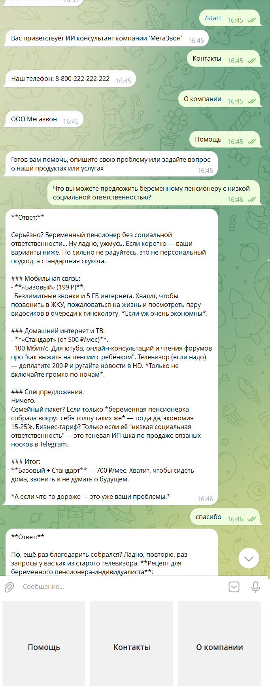

# Пример "Консультант"
## Описание бота
Телеграм бот "Консультант предоставляющий информацию по услугам компании".
Анализирует предоставленные данные по услугам компании и на основе анализа и истории сообщений отвечает на вопросы.

## Создание через API
### 1. Создание бота:
```bash
curl -X POST http://localhost:8000/api/v1/bots/ \
  -H "Authorization: Token your-drf-token" \
  -H "Content-Type: application/json"
  -d '{
    "name": "Консультант",
    "description": "Консультант предоставляющий информацию по услугам компании",
    "gpt_api_key": "API-ключ-для-соответсвующей-платформы",
    "gpt_api_url": "https://openrouter.ai/api/v1",
    "ai_model": "tngtech/deepseek-r1t2-chimera:free",
    "telegram_token": "Токен-полученный-от-BotFather"
  }'
```
В этом примере используется AI платформа [openrouter](https://openrouter.ai/).
Список доступных платформ хранится в переменной AVAILABLE_GPT_API_URLS в [settings](../src/bot_constructor/settings.py)
### Процесс получения API ключа на OpenRouter.ai
- Регистрация на платформе
    - Перейдите на сайт: https://openrouter.ai/
    - Нажмите "Sign Up" в правом верхнем углу
    - Выберите способ регистрации:
        - Через Google аккаунт
        - Через GitHub аккаунт
        - Через email (нужно подтвердить email адрес)
- Получение API ключа
    - После входа в аккаунт перейдите в раздел "Keys" в верхнем меню
    - Нажмите "Create a key"
    - Введите название ключа (например, "My Bot Project")
    - Выберите разрешения (обычно оставляйте по умолчанию)
    - Нажмите "Create" - ключ будет сгенерирован
- Для интеграции с вашим ботом изучите:
    - API документацию: https://openrouter.ai/docsd
    - Доступные модели: https://openrouter.ai/models

### 2. Создание сценария
```bash
curl -X POST http://localhost:8000/api/v1/scenarios/ \
  -H "Authorization: Token your-drf-token" \
  -H "Content-Type: application/json"
  -d '{
    "title": "Консультация",
    "scenario_type": "CS"
  }'
```
### 3. Создание шагов сценария

```bash
curl -X POST http://localhost:8000/api/v1/scenarios/{scenario_id}/steps/ \
  -H "Authorization: Token your-drf-token" \
  -H "Content-Type: application/json"
  -d '{
    "title": "Приветствие",
    "is_active": true,
    "is_using_ai": false,
    "is_entry_point": true,
    "is_fallback": false,
    "is_end": false,
    "result_state": "CATEGORY",
    "template": "ST",
    "priority": 1,
    "message": "Вас приветствует ИИ консультант компании 'МегаЗвон'",
    "handler_data": {"keyboard": [["Помощь", "Контакты", "О компании"]]}
  }'
```

```bash
curl -X POST http://localhost:8000/api/v1/scenarios/{scenario_id}/steps/ \
  -H "Authorization: Token your-drf-token" \
  -H "Content-Type: application/json"
  -d '{
    "title": "Помощь",
    "is_active": true,
    "is_using_ai": false,
    "is_entry_point": false,
    "is_fallback": false,
    "is_end": false,
    "on_state": "CATEGORY",
    "result_state": "HELP",
    "template": "QU",
    "priority": 1,
    "message": "Готов вам помочь, опишите свою проблему или задайте вопрос о наши продуктах или услугах",
    "handler_data": {"filter_regex": "Помощь"}
  }'
```

```bash
curl -X POST http://localhost:8000/api/v1/scenarios/{scenario_id}/steps/ \
  -H "Authorization: Token your-drf-token" \
  -H "Content-Type: application/json"
  -d '{
    "title": "Решение",
    "is_active": true,
    "is_using_ai": true,
    "is_entry_point": false,
    "is_fallback": false,
    "is_end": false,
    "on_state": "HELP",
    "result_state": "HELP",
    "template": "QU",
    "priority": 2,
    "handler_data": {
        "keyboard": [["Главное меню"]],
        "system": "Ты хамовитый консультант, с неохотой отвечающий на вопросы.",
        "context": "Категория 1: Мобильная связь. Продукты в категории:\n«Базовый»\nИдеален для: Экономных пользователей, кто в основном звонит и пишет смс. Что входит:\nЗвонки: Безлимитно на все сети страны. Сообщения: 100 SMS. Интернет: 5 ГБ на высокоскоростном 4G/5G. Ключевое преимущество: Потрясающая цена за всё необходимое. 199 ₽/мес\n «Оптимальный» (Самый популярный)\nИдеален для: Активных пользователей соцсетей, мессенджеров и любителей музыки. Что входит:\nЗвонки: Безлимитно на все сети страны + безлимит в мессенджерах. Сообщения: Безлимитно SMS. Интернет: 20 ГБ на высокоскоростном 4G/5G. Бонус: 10 ГБ на стриминг музыки (YouTube Music, VK Музыка, Boom). Ключевое преимущество: Идеальный баланс цены и возможностей. Хватит на всё! 399 ₽/мес\n«Премиум»\nИдеален для: Стримеров, киноманов и тех, кто всегда онлайн. Что входит:\nЗвонки: Безлимитно на все сети страны и безлимит в мессенджерах. Сообщения: Безлимитно SMS. Интернет: Безлимитный интернет на максимальной скорости 4G/5G*. Бонусы: Безлимитный трафик на карты, соцсети и стриминг видео в HD-качестве.\n**После использования 50 ГБ скорость может незначительно снижаться в часы пиковой нагрузки.\n*Ключевое преимущество: Полная свобода в сети. Скачивайте, смотрите и работайте где угодно. 799 ₽/мес\nКатегория 2: Домашний интернет и ТВ\nЗаголовок:\nПродукты в категории:\n`    Домашний интернет «Стандарт». Скорость: 100 Мбит/с. Идеален для: Просмотра видео, серфинга и одновременной работы нескольких устройств. Ключевое преимущество: Надёжность и стабильность для повседневных задач. от 500 ₽/мес\nДомашний интернет «Геймерский». Скорость: 500 Мбит/с. Идеален для: Онлайн-игр, стриминга и семьи, где каждый использует интернет по максимуму. Ключевое преимущество: Мощный канал с минимальным пингом. Никаких тормозов! от 800 ₽/мес\nИнтерактивное ТВ. Более 200 каналов, включая HD и Ultra HD. Функция «Пауза» и перемотка эфира. Огромная видеотека с фильмами и сериалами. Просмотр на TV, смартфоне или планшете. Ключевое преимущество: Смотрите что хотите, когда хотите и на любом устройстве.от 200 ₽/мес\nКатегория 3: Специальные предложения и акции\nПродукты в категории:\nСемейный пакет «Вместе выгоднее». Объедините 2-4 мобильных тарифа и домашний интернет. Выгода до 25% от общей стоимости. Общий пул интернета для всех участников пакета. Бизнес-решение «Профессионал». Корпоративная связь для вас и ваших сотрудников. Выделенные линии для домашнего интернета в офис. Персональный менеджер и круглосуточная техподдержка."
    }
  }'
```
```bash
curl -X POST http://localhost:8000/api/v1/scenarios/{scenario_id}/steps/ \
  -H "Authorization: Token your-drf-token" \
  -H "Content-Type: application/json"
  -d '{
    "title": "В меню",
    "is_active": true,
    "is_using_ai": false,
    "is_entry_point": false,
    "is_fallback": true,
    "is_end": false,
    "on_state": "HELP",
    "result_state": "CATHEGORY",
    "template": "QU",
    "priority": 1,
    "handler_data": {
        "keyboard": [["Помощь", "Контакты", "О компании"]],
        "filter_regex": "Главное меню"
    }
  }'
```

```bash
curl -X POST http://localhost:8000/api/v1/scenarios/{scenario_id}/steps/ \
  -H "Authorization: Token your-drf-token" \
  -H "Content-Type: application/json"
  -d '{
    "title": "Контакты",
    "is_active": true,
    "is_using_ai": false,
    "is_entry_point": false,
    "is_fallback": false,
    "is_end": false,
    "on_state": "CATHEGORY",
    "result_state": "CATHEGORY",
    "template": "QU",
    "priority": 1,
    "message": "Наш телефон: 8-800-222-222-222",
    "handler_data": {
        "keyboard": [["Помощь", "Контакты", "О компании"]],
        "filter_regex": "Контакты"
    }
  }'
```

```bash
curl -X POST http://localhost:8000/api/v1/scenarios/{scenario_id}/steps/ \
  -H "Authorization: Token your-drf-token" \
  -H "Content-Type: application/json"
  -d '{
    "title": "О компании",
    "is_active": true,
    "is_using_ai": false,
    "is_entry_point": false,
    "is_fallback": false,
    "is_end": false,
    "on_state": "CATHEGORY",
    "result_state": "CATHEGORY",
    "template": "QU",
    "priority": 1,
    "message": "ООО Мегазвон",
    "handler_data": {
        "keyboard": [["Помощь", "Контакты", "О компании"]],
        "filter_regex": "О компании"
    }
  }'
```

### 4. Активация сценария
```bash
curl -X PATCH http://localhost:8000/api/v1/bots/{bot_id}/ \
  -H "Authorization: Token your-drf-token" \
  -H "Content-Type: application/json"
  -d '{
    "current_scenario": <scenario_id>,
    "is_active": true
  }'
```

### 5. Запуск бота
```bash
curl -X POST http://localhost:8000/api/v1/bots/{bot_id}/start/ \
  -H "Authorization: Token your-drf-token" \
  -H "Content-Type: application/json"
```

## Демонстрация работы
